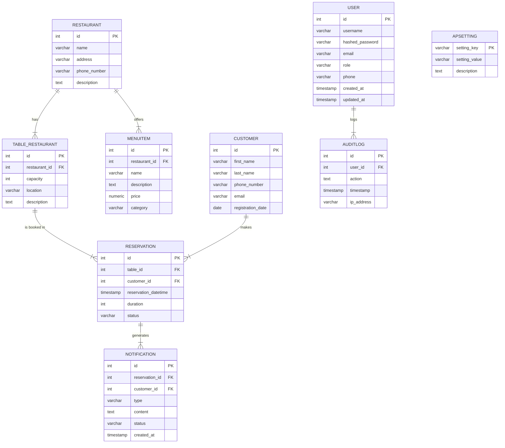

```mermaid
erDiagram
    RESTAURANT ||--|{ TABLE_RESTAURANT : "has"
    RESTAURANT ||--|{ MENUITEM : "offers"
    TABLE_RESTAURANT ||--|{ RESERVATION : "is booked in"
    CUSTOMER ||--|{ RESERVATION : "makes"
    RESERVATION ||--|{ NOTIFICATION : "generates"
    USER ||--|{ AUDITLOG : "logs"

    %% AppSetting не имеет прямых FK-связей,
    %% но триггеры Reservation читают из AppSetting.

    RESTAURANT {
        int id PK
        varchar name
        varchar address
        varchar phone_number
        text description
    }

    TABLE_RESTAURANT {
        int id PK
        int restaurant_id FK
        int capacity
        varchar location
        text description
    }

    CUSTOMER {
        int id PK
        varchar first_name
        varchar last_name
        varchar phone_number
        varchar email
        date registration_date
    }

    RESERVATION {
        int id PK
        int table_id FK
        int customer_id FK
        timestamp reservation_datetime
        int duration
        varchar status
    }

    MENUITEM {
        int id PK
        int restaurant_id FK
        varchar name
        text description
        numeric price
        varchar category
    }

    USER {
        int id PK
        varchar username
        varchar hashed_password
        varchar email
        varchar role
        varchar phone
        timestamp created_at
        timestamp updated_at
    }

    AUDITLOG {
        int id PK
        int user_id FK
        text action
        timestamp timestamp
        varchar ip_address
    }

    NOTIFICATION {
        int id PK
        int reservation_id FK
        int customer_id FK
        varchar type
        text content
        varchar status
        timestamp created_at
    }
    
    APSETTING {
        varchar setting_key PK
        varchar setting_value
        text description
    }
```